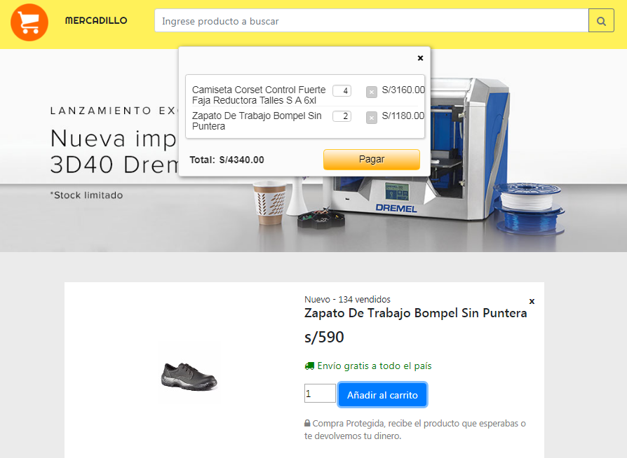

# E-commerce

Aplicación que obtiene los productos del API de Mercado Libre y realiza una compra electrónica a traves del API de Paypal.

# Herramientas Utilizadas

- Html5
- Css3
- Jquery
- Api de Mercado libre, Paypal

## Vistas

* La busqueda se realiza introduciendo el producto a buscar click en el boton VER para poder comprar.

* Se mostrará un botón para añadir al carrito y realizar la compra respectiva.

* Después se mostrará un resumen con todos los productos que desee comprar y se le direccionara a paypal para hacer el respectivo pago.

# Autores
- Elena Japa
- Lilliam Haro
